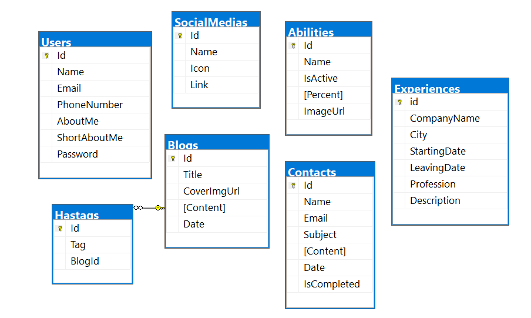

# Portfolio Database Design

Bu README dosyası, **PortfolioDB** adlı veritabanı tasarımını açıklamak ve içerdiği tablolar arasındaki ilişkiyi anlatmak için hazırlanmıştır.

## Proje Tanımı

Bu proje, kişisel bir portfolyo websitesi için gerekli veritabanı yapısını içermektedir. Proje, kullanıcıların yeteneklerini, blog yazılarını, iletişim bilgilerini, deneyimlerini ve daha fazlasını saklamak ve yönetmek için tasarlanmıştır.

## Portfolyo Veritabanı Diyagramı

## Tablolar ve İlişkiler

Veritabanı, aşağıdaki tabloları içermektedir:

### Users
Kullanıcıların temel bilgilerini içerir. Kullanıcı adı, e-posta, telefon numarası gibi bilgiler bu tabloda tutulur.

- **Id**: Kullanıcı kimlik numarası.
- **Name**: Kullanıcının adı.
- **Email**: Kullanıcının e-posta adresi.
- **PhoneNumber**: Kullanıcının telefon numarası.
- **AboutMe**: Kullanıcının kendisi hakkında açıklama.
- **ShortAboutMe**: Kullanıcının kendisi hakkında kısa bir açıklaması.
- **Password**: Kullanıcının şifresi.

### Abilities
Kullanıcıların sahip olduğu yetenekleri temsil eder. Yetenek adı, yüzde değeri ve simgesi gibi bilgiler bu tabloda saklanır.

- **Id**: Yetenek kimlik numarası.
- **Name**: Yeteneğin adı.
- **IsActive**: Yeteneğin aktif olup olmadığı.
- **Percent**: Yetenek yüzde değeri.
- **ImageUrl**: Yeteneği gösteren bir resim URL'i.

### Blogs
Kullanıcıların yazdığı blog yazılarını içerir. Başlık, kapak resmi URL'si, içerik ve tarih gibi önemli detaylar bu tabloda bulunur.

- **Id**: Blog kimlik numarası.
- **Title**: Blog yazısının başlığı.
- **CoverImgUrl**: Blog yazısının kapak resmi URL'i.
- **Content**: Blog yazısının içeriği.
- **Date**: Blog yazısının tarihi.

### Contacts
İletişim formundan gelen iletişim taleplerini saklar. Ad, e-posta, konu, içerik, tarih ve tamamlanma durumu gibi bilgiler bu tabloda yer alır.

- **Id**: İletişim talep kimlik numarası.
- **Name**: Gönderenin adı.
- **Email**: Gönderenin e-posta adresi.
- **Subject**: İletişim talebinin konusu.
- **Content**: İletişim talebinin içeriği.
- **Date**: İletişim talebinin tarihi.
- **IsCompleted**: İletişim talebinin tamamlanma durumu.

### Experiences
Kullanıcının çalıştığı deneyimleri temsil eder. Şirket adı, şehir, başlama ve bitiş tarihleri, pozisyon ve açıklama gibi detayları içerir.

- **Id**: Deneyim kimlik numarası.
- **CompanyName**: Deneyimin yaşandığı şirket adı.
- **City**: Şirketin bulunduğu şehir.
- **StartingDate**: Deneyimin başlama tarihi.
- **LeavingDate**: Deneyimin bitiş tarihi.
- **Profession**: Deneyimdeki pozisyon.
- **Description**: Deneyim hakkında açıklama.

### Hashtags
Blog yazıları için kullanılan etiketleri saklar. Etiket adı ve hangi bloga ait olduğu bilgisi bu tabloda bulunur.

- **Id**: Etiket kimlik numarası.
- **Tag**: Etiketin adı.
- **BlogId**: Hangi blog yazısına ait olduğu.

### SocialMedias
Kullanıcının sosyal medya profillerini içerir. Sosyal medya adı, simge ve profil bağlantısı gibi verileri tutar.

- **Id**: Sosyal medya kimlik numarası.
- **Name**: Sosyal medya platformunun adı.
- **Icon**: Sosyal medya platformunun simgesi.
- **Link**: Kullanıcının sosyal medya profil bağlantısı.

## Veritabanı İlişkisi

- **Blogs** tablosu ile **Hashtags** tablosu arasında 1'den çok ilişki bulunur. Her bir blog yazısı birden çok etiket içerebilir.

## Kurulum

1. Veritabanını oluşturmak için script dosyasını SQL Server Management Studio veya benzeri bir araçla çalıştırın.
2. Projeyi yerel makinenizde veya sunucunuzda çalıştırın.
3. Veritabanına erişim kodları ve bağlantı detayları eklemeyi unutmayın.
